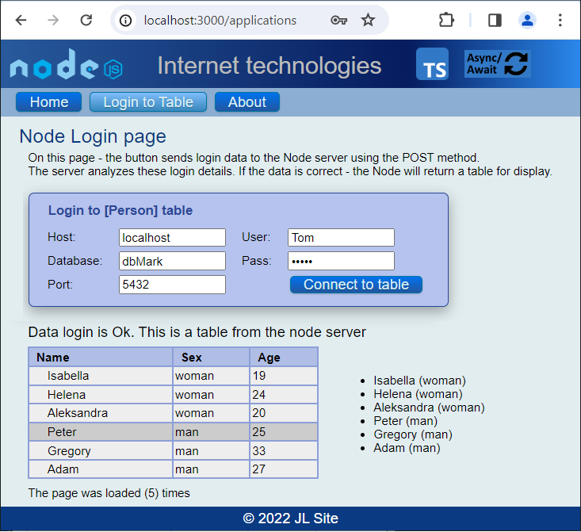

## The Node Express JS app with the controller structure

This web application demonstrates the use of GET and POST methods 
by making browser requests to a node server and vice versa.

This application has:

- Express framework;
- TypeScript language;
- Asynchronous work of the application (async/await);
- Built-in middleware: express.static;
- Partials (layouts) of header, footer
- Hbs template engine;
- Helpers: [#each], [#if];
- Multi-page portal - switching from the menu;
- Request handling: Get, Post;
- Configured tsconfig.json file;
- Debug enabled on the node server side (.map files);
- Folder [disc] of compiled .js files;
- Division into files .ts structure in [src] folder:
    - Server;
    - App_hbs;
    - Routers;
    - Controller applications (POST method);
    - Controller pages (GET method);
    - Data class;

.

## Application operation

This application has a good file structure for separating tasks in the back-end: app, router, controllers. 
Many websites are used in large web-apps. Handling multiple pages in one file - causes confusion and lack of order. 
Therefore, tasks are divided into different folders and files. GET commands are handled by [\src\controllers\controller.pages.ts], POST by [src/controllers/controller.app.ts] and separation is handled by: [\src\routes\routerts.ts].      

Pages are switched via the Get method. The router finds the correct EndPoint and based on it, renders the page to the browser. On Log page - the button sends login data to the Node server using the POST method. The server analyzes these login details. If the data is correct - the Node will return a table for display.
